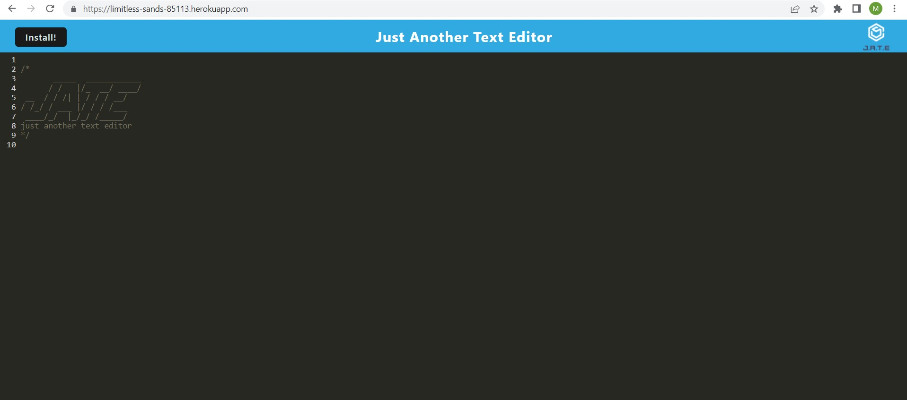

# pwaEditor
## Homework 19 - PWA

This application creates notes or code snippets with or without an internet connection, so developers can reliably retrieve them for later use.

## Mock-up

## Installation

This application requires installation of npm (incl. concurrently, code-mirror-names, express, idb, nodemon, and webpack) and Heroku. For a complete let is node modules to install, please examine the package.json files at the link below.

All elements of the application can be examined here: https://github.com/matthewestes33/pwaEditor

The deployed application can be used here: https://limitless-sands-85113.herokuapp.com/

## Credits

Additional assistance:

Thank you to my instructional staff Farish and Riley, tutor Juan Delgado, and AskBCS Learning Assistants!

## Features

When a developer opens the application, a client/server folder structure is present.

When the developer enters the command `npm run start` from the root directory, the application starts and serves the client.

When the developer runs the text editor application from the terminal, the JavaScript files have been bundled using webpack.

When the developer runs the webpack plugins, an HTML file, service worker, and a manifest file are generated.

When the developer uses the next-gen JavaScript in the application, the text editor functions in the browser without errors.

When the developer opens the text editor, IndexedDB immediately creates a database storage.

When the developer enters content and subsequently clicks off of the DOM window, the content in the text editor is saved with IndexedDB.

When the developer reopens the text editor after closing it, the content in the text editor is retrieved from IndexedDB.

When the developer clicks on the Install button, the web application is downloaded, and creates as icon on the developer's desktop.

Upon loading the web application, there is a registered service worker using workbox.

Upon registering the service worker, the static assets are pre cached upon loading along with subsequent pages and static assets.

Upon deploying to Heroku, the proper build scripts for a webpack application are present. 
